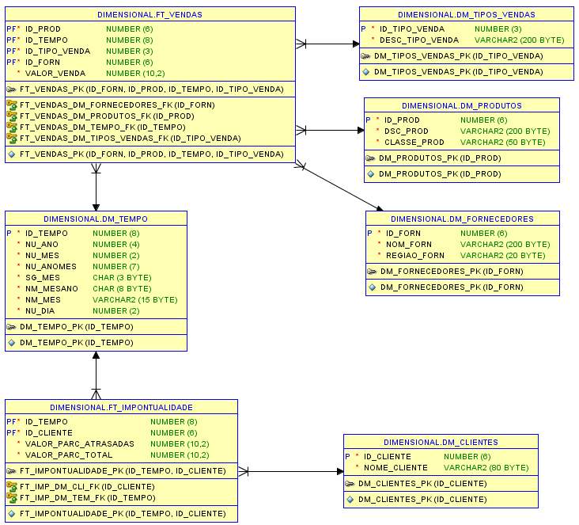

# Rotina ETL - Vendas

Rotina ETL para uma base de dados de controle de vendas. Atividade para a matéria Laboratório de Banco de Dados.

## Instruções

O objetivo da atividade é extrair os dados do banco operacional (extract), transformar as informações (transform) e carregar no banco de dados dimensional (load).

Esquema do Banco Operacional:  


Esquema do Banco Dimensional:  


## Rotina ETL
Para rodar a rotina ETL, é necessário que o [Python](https://www.python.org/downloads/) esteja instalado na máquina e precisamos instalar as bibliotecas requeridas.
Executa-se o comando:
```
pip install -r requirements.txt
```
Então, executa-se o arquivo do script:
```
python script.py
```

## Notebook
Para uma melhor visualização do passo a passo do script, há o arquivo `notebook.ipynb`


---
[](https://colab.research.google.com/github/nataliafonseca/etl_vendas/blob/main/notebook.ipynb)